# Teachers API Automation

## Project Overview

This project contains automated API tests for Authentication and Teachers CRUD APIs using Postman and Newman.

## Technologies

* Postman
* Newman
* Node.js
* HTML Extra Reporter

## Test Cases

1. Login Authentication
2. Create Teacher
3. Get All Teachers
4. Get Teacher by ID
5. Update Teacher
6. Delete Teacher
7. Negative Test Scenarios

## How to Run

### Install Newman

```
npm install -g newman
```

### Run Collection

```
newman run collection.json
```

### Generate HTML Report

```
newman run collection.json -r htmlextra
```
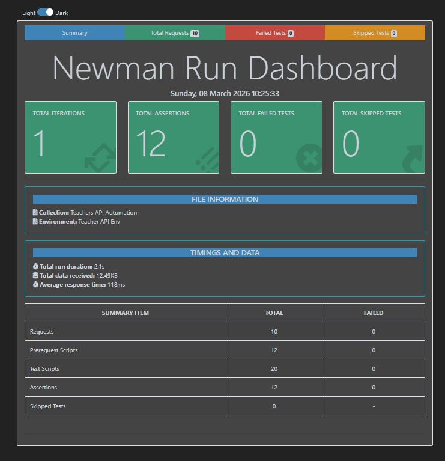

## Project Files

* collection.json (Postman Collection)
* environment.json (Environment File)
* HTML Report

## Drive Folder

## 1. Token Saved

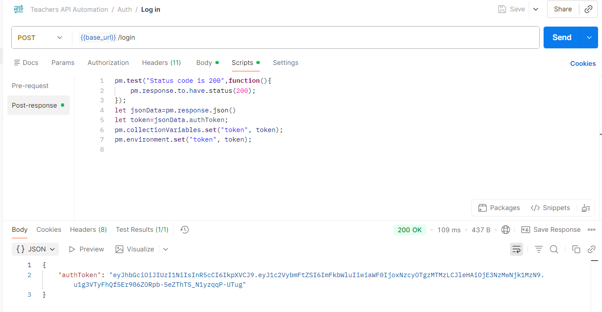

---
## 2. Environment variable Saved

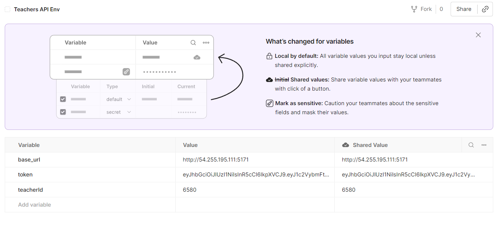

---

## 3. Create Teacher and Save teacherId

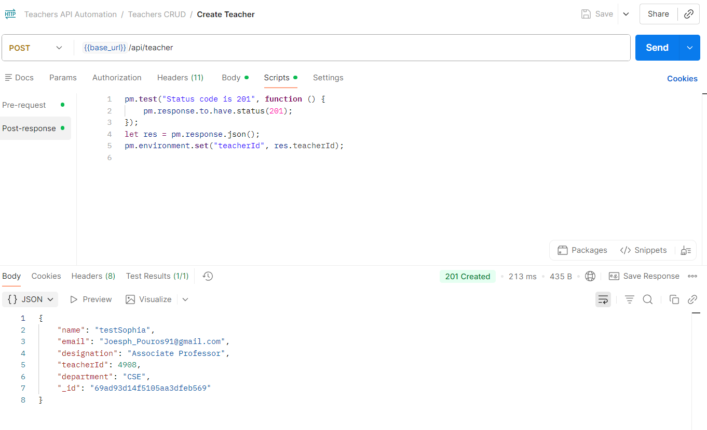

---
## 4. Get Teacher by id

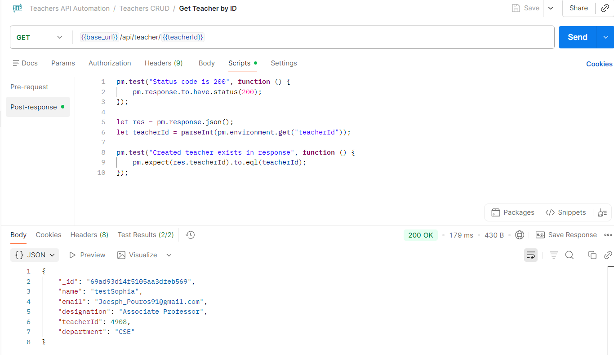

---

## 5. Update Teacher Verified

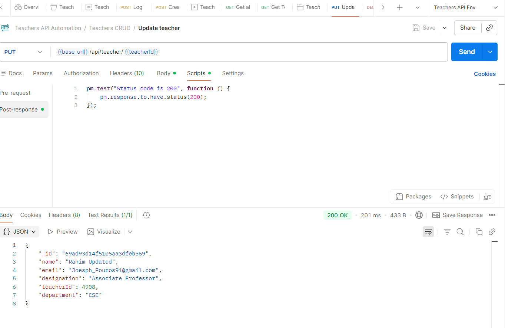

---

## 6. Delete Teacher + 404 Verification

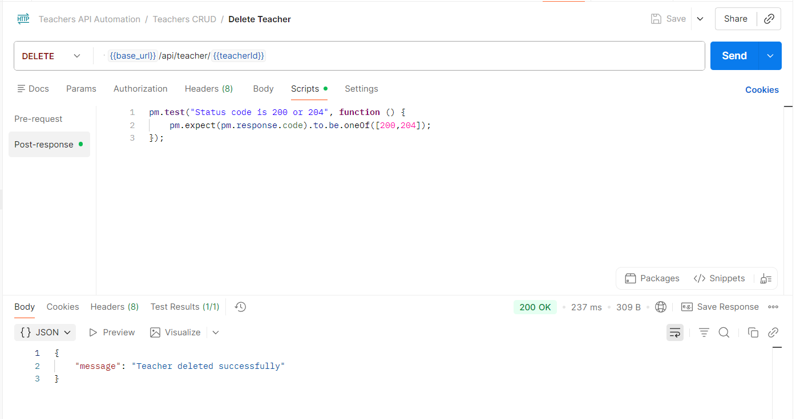

---

## 7. Negative Test Cases Passing

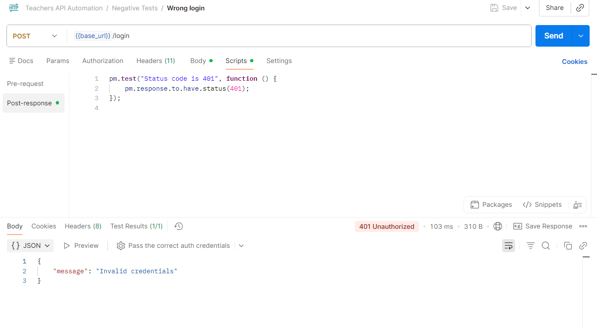
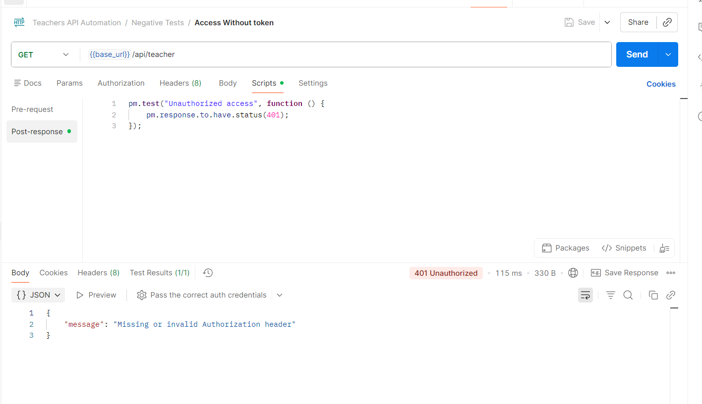
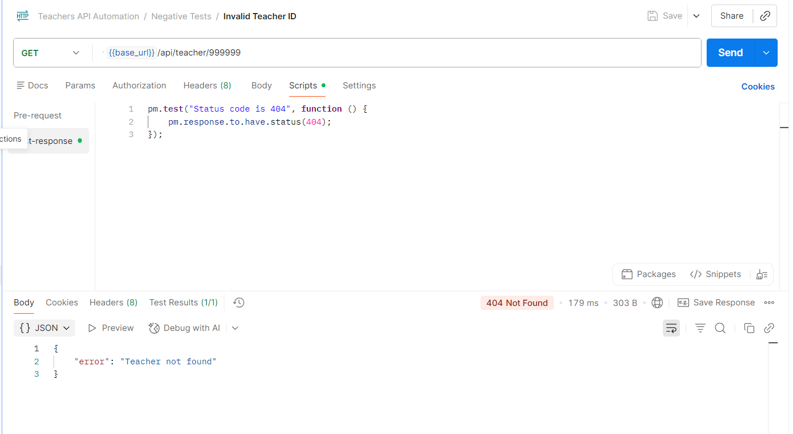
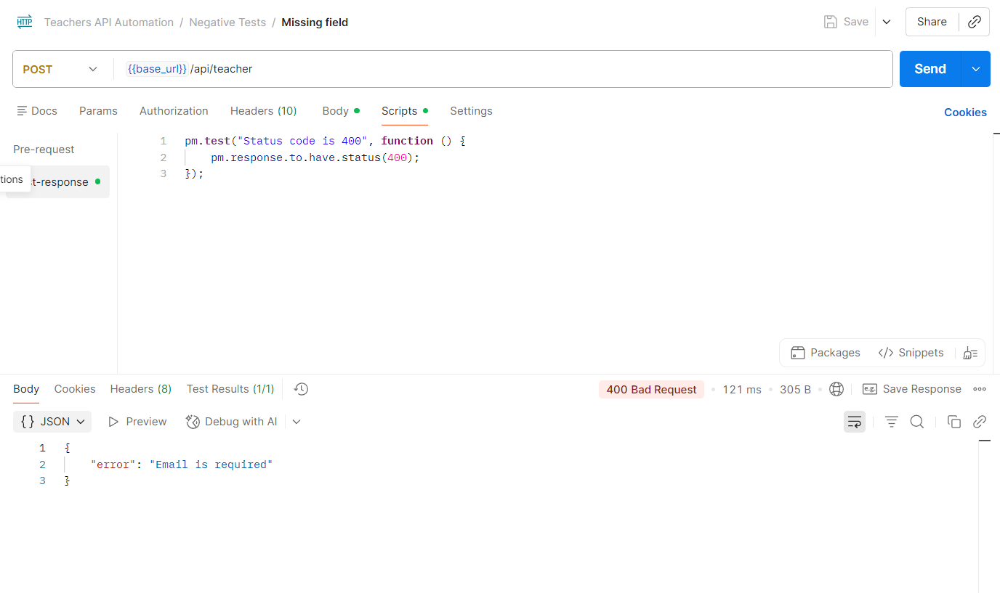

## Video Demonstration

(Add Video Link Here)


